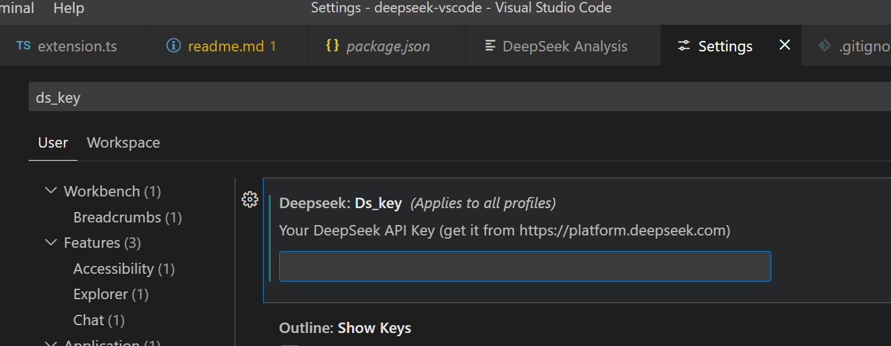
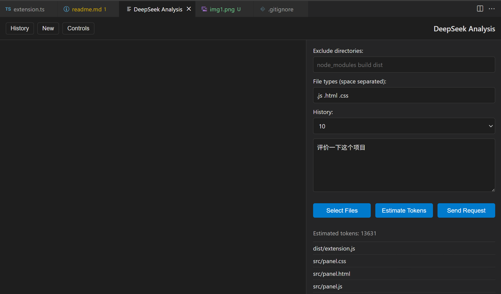
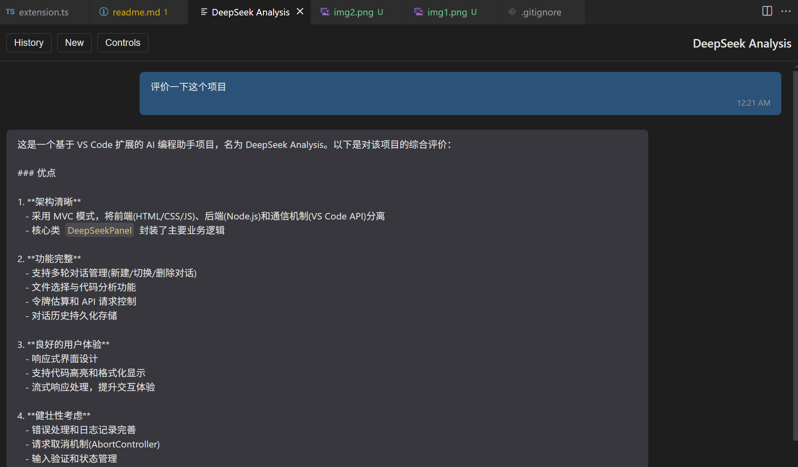
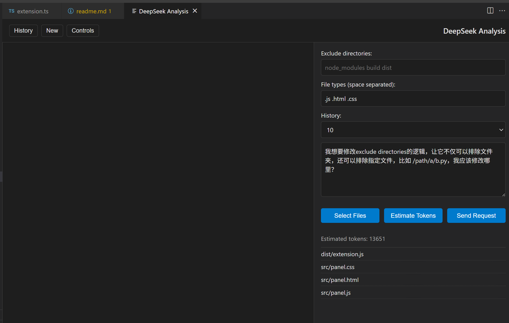
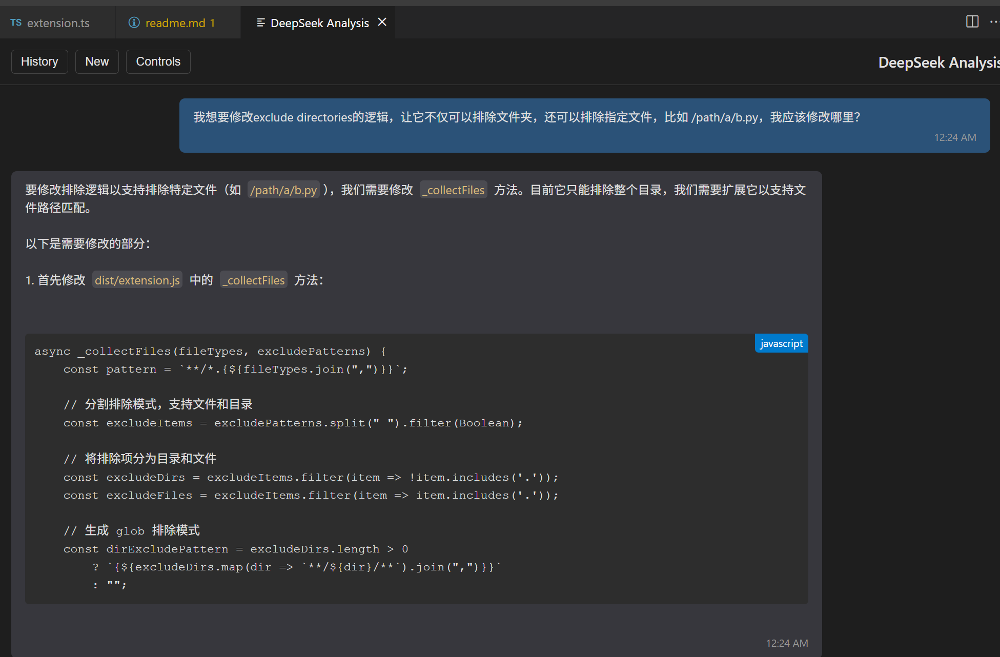
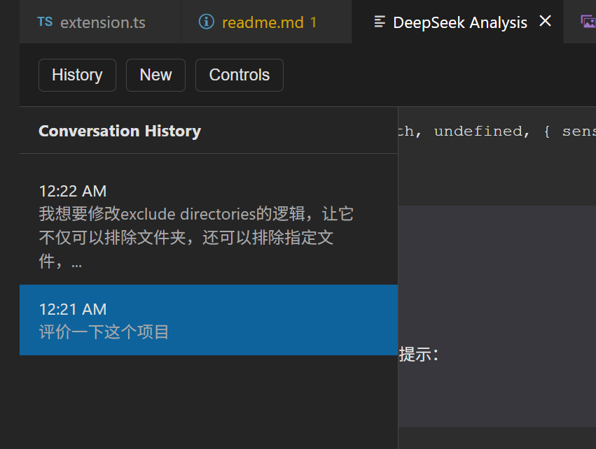

# Overview

1. Set Deepseek api key



2. `shift+ctrl+P` open command panel and type `Deekseek analyze` to open deepseek panel

3. write problem description



4. get response



5. more detailed question





6. conversation history



## How to Install 

```
npm install -g @vscode/vsce
vsce package
code --install-extension deepseek-vscode-1.0.0.vsix
```

